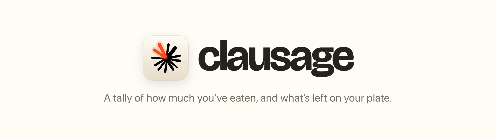
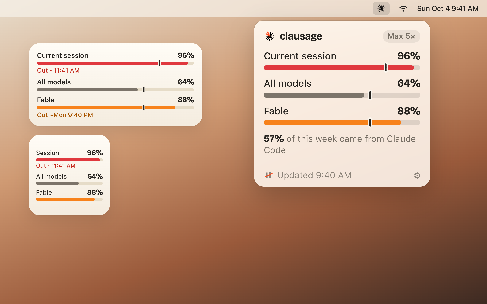
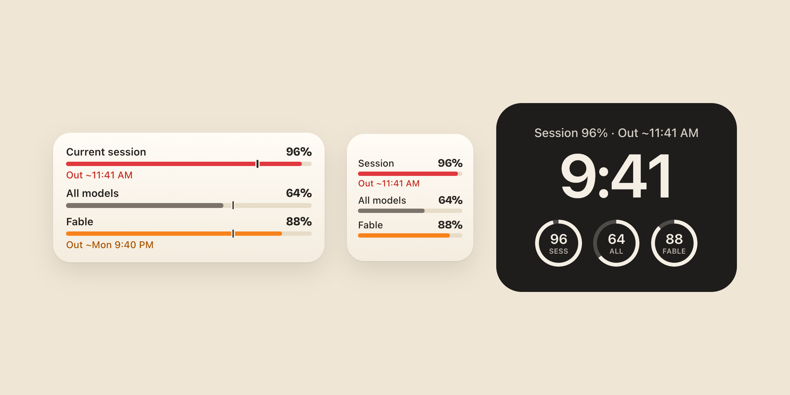

<p align="center">
  <picture>
    <source media="(prefers-color-scheme: dark)" srcset="media/banner-dark.png">
    
  </picture>
</p>

<p align="center">
  <a href="https://clausage.ai/updates/Clausage.zip"><b>Download for Mac</b></a> ·
  <a href="https://clausage.ai">clausage.ai</a> ·
  <a href="#privacy">Privacy</a>
</p>

Clausage keeps your Claude plan limits in the Mac menu bar and on your iPhone, and tells you when you'll run out if you keep up the sizzle.

<p align="center">
  
</p>

## What's on the plate

- **Menu bar icon.** The rays fill in clockwise as your busiest limit gets used. No number needed.
- **One link per limit.** Current session, All models and each per-model limit, each with its own bar.
- **Pace tick.** Shows how much you'd have eaten by now at an even pace. Bar ahead of the tick? Slow down and chew.
- **Forecast.** Past 85%, you get `Out ~Mon 9:40 PM`: when you'll clean your plate, if that's before the reset serves seconds.
- **Weekly running total.** Your week filling up day by day against an even pace, plus which product had the biggest appetite.
- **Widgets.** Mac desktop, iPhone Home Screen and Lock Screen.
- **Nudges.** Optional notifications at 85% and 95%, when you're on track to clean your plate early, and when a limit resets.

## Frankly, it keeps quiet

| Used | Bar | What you see |
|---|---|---|
| Under 85% | Warm gray | Nothing extra. Plenty left on the plate. |
| 85% and up | Orange | Getting full. A runout time, if it lands before the reset. |
| 95% and up | Red | Last bites. Wrap it up, or wait for seconds. |

The bar color comes from the percentage alone. The `~` means the forecast is a guess, not gospel.

## Links on every screen

<p align="center">
  
</p>

Your limits sit on your desktop, Home Screen and Lock Screen, so one glance tells you if there's room for another bite before you start a big task.

## What's in the grinder (Mac only)

Turn on **Scan Claude Code sessions** and Clausage breaks down what's eating your Claude Code limit, with a tip for each:

- parallel sessions and long context,
- your top skills and subagents,
- how many times you hit the wall this week.

It reads `~/.claude` on your Mac. Only totals are kept, never prompts or code, and nothing leaves the Mac.

## Privacy

Nothing funny in the casing.

- **What it reads:** your plan's type, limits, usage credits and how much you've used, from claude.ai.
- **What it never sees:** your password. You sign in on claude.ai's own page, and Clausage never reads it.
- **Where it lives:** on your device. The iPhone app is standalone, with no iCloud sync.

No analytics, no ads, no tracking. The full policy is at [clausage.ai/privacy](https://clausage.ai/privacy).

## Install

**Requires a Claude Pro or Max plan.** Free plans don't have a usage page on claude.ai, so Clausage has nothing to read.

- **Mac** (macOS 14 or later): [download the latest version](https://clausage.ai/updates/Clausage.zip), unzip it and move Clausage to Applications. It's signed and notarized, and updates itself.
- **iPhone** (iOS 17 or later): not on the App Store yet. [Build it from source](#build-from-source).

Open Clausage, sign in to Claude, and the first link drops.

## Build from source

Needs Xcode and [XcodeGen](https://github.com/yonaskolb/XcodeGen) (`brew install xcodegen`). `project.yml` is the source of truth; the Xcode project is generated.

```sh
git clone https://github.com/traviskirton/clausage.git
cd clausage
xcodegen generate
open Clausage.xcodeproj
```

Schemes: **Clausage** (Mac app and widget), **ClausageiOS** (iPhone app and widgets), **ClausageTests** (unit tests). To run on your own devices, set `DEVELOPMENT_TEAM` in `project.yml` to your team and change the `com.postfl.clausage` bundle IDs, App Group and Keychain group to ones you own.

## Feedback

Spotted wrong numbers or have an idea? [Open an issue](../../issues), or use **Send Feedback** in the app.

---

<sub>Clausage is an independent app, not made by or affiliated with Anthropic. Claude is a trademark of Anthropic. No actual sausages were harmed.</sub>
